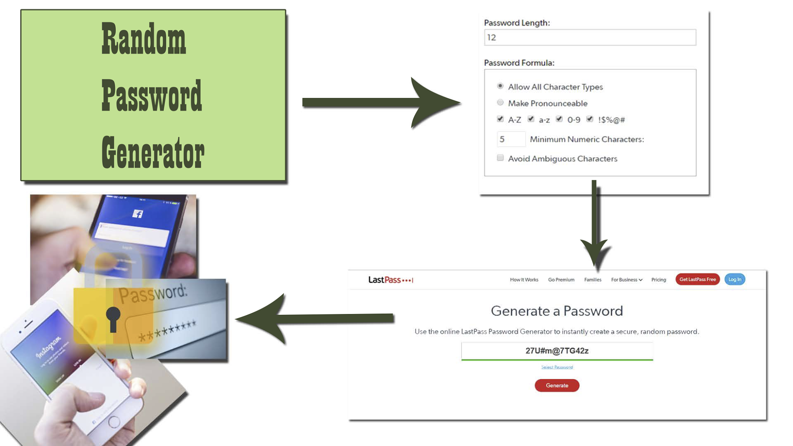
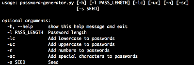
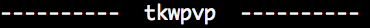
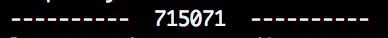
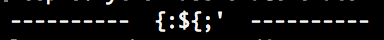
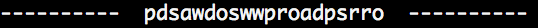

# PythonPasswordGenerator
This program was created in python for a school project. It runs on the command line. It can create passwords of diferent lengths and you can have a seed of your choice.





[](https://asciinema.org/a/SengOaNF0rOhfoqdIPfpHR8cb)


> This is a python command line interface for making random passwords.


## prerequisites
you need to install python
* python 3 - [Python](https://www.python.org/)
## Installation

### OS X & Linux:

```sh
git clone https://github.com/Leandro-Trinidad-QECS/PythonPasswordGenerator.git
```

### Windows:
*  Download the python Password Generator
Download - [Python Password generator](https://github.com/Leandro-Trinidad-QECS/PythonPasswordGenerator/archive/master.zip)

## Usage

A few motivating and useful examples of how your product can be used. Spice this up with code blocks and potentially more screenshots.

> Shows how you can use it



```sh
python3 password-generator.py -h
```
> options
```sh
python3 password-generator.py [OPTIONS]
```
```sh
  -l              How long you want the password to be
  -lc             Make your password have lowercase letters
  -uc             Make your password have uppercase letters
  -n              Make your password have numbers
  -sc             Make your password have Special characters
  -s SEED         Seed, what letters/numbers you want to be included in your password

```
> lowercase letters
```sh
python3 password-generator.py -l 6 -lc
```

> uppercase letters
```sh
python3 password-generator.py -l 6 -uc
```

> numbers
```sh
python3 password-generator.py -l 6 -n
```

> special characters
```sh
python3 password-generator.py -l 6 -sc
```



> You can mix and match the options


```sh
python3 password-generator.py -l 20 -lc -uc -n -sc
```


> or you can use a seed
whatever letters you use in the seed, the program will choose randomly from those to be part of your newly generated password.


```sh
python3 password-generator.py -l 20 -s password
```



